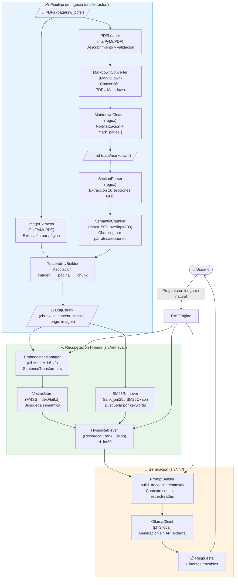

# Sistema RAG para Fichas de Datos de Seguridad (FDS) — CORONA
## Informe Académico Completo — NLP Parcial Final

**Grupo:** Corona  
**Asignatura:** Procesamiento de Lenguaje Natural (NLP)  
**Repositorio:** `rag_fds-main`  
**Fecha:** Mayo 2026

---

## 1. RESUMEN EJECUTIVO

El presente proyecto implementa un sistema de **Recuperación Aumentada por Generación (RAG)** orientado al análisis y consulta de Fichas de Datos de Seguridad (FDS) del fabricante CORONA. El sistema ejecuta un pipeline documental completamente reproducible que convierte documentos PDF a formato Markdown estructurado, extrae las 16 secciones normativas, segmenta el contenido en chunks semánticos con trazabilidad completa, y permite consultas en lenguaje natural respondidas por un LLM local a través de Ollama.

El sistema destaca por su **arquitectura portable y de bajo costo computacional**: no depende de ninguna API externa de pago, utiliza exclusivamente herramientas open source, y puede ejecutarse en hardware local o en AWS. El modelo de lenguaje (phi3 vía Ollama), el motor de embeddings (sentence-transformers `all-MiniLM-L6-v2`) y la base vectorial (FAISS CPU) operan íntegramente en infraestructura propia. La estrategia de recuperación híbrida (semántica + BM25 con Reciprocal Rank Fusion) permite una recuperación precisa incluso con vocabulario técnico especializado en regulación química colombiana.

---

## 2. ARQUITECTURA GENERAL DEL SISTEMA

### 2.1 Explicación Arquitectónica

El sistema está organizado en cinco capas funcionales bien delimitadas, cada una con responsabilidades específicas y desacopladas:

**Capa 1 — Ingesta Documental** (`src/extractor/`): Responsable de descubrir, validar y leer documentos PDF. La clase `PDFLoader` soporta rutas de archivos individuales, directorios completos y archivos ZIP. La librería `PyMuPDF (fitz)` se usa para validación y extracción de imágenes, mientras que `MarkItDown` se encarga de la conversión a Markdown. El módulo `MarkdownCleaner` aplica reglas de limpieza normalizando encabezados de sección, removiendo artefactos de paginación y marcando los cambios de página con tokens estructurados `[[PAGE_X]]`.

**Capa 2 — Parsing Estructural** (`src/parser/`): El `SectionParser` identifica las 16 secciones normativas GHS/SGA mediante expresiones regulares sobre el Markdown generado. El `TraceabilityBuilder` vincula imágenes extraídas a chunks por proximidad de página y construye bloques de contexto enriquecidos con metadatos de fuente para el prompt del LLM.

**Capa 3 — Chunking Semántico** (`src/chunker/`): El `SemanticChunker` divide el contenido en fragmentos respetando la estructura semántica del documento (por párrafos y secciones). Los parámetros son `max_chunk_size=1500` caracteres y `overlap=200` caracteres. El modelo de datos `Chunk` (`src/chunker/models.py`) encapsula el contenido junto con metadatos de trazabilidad: sección, página inicial, página final, archivo fuente e imágenes asociadas.

**Capa 4 — Recuperación Híbrida** (`src/retrieval/`): Implementa dos estrategias complementarias fusionadas mediante Reciprocal Rank Fusion (RRF). El `VectorStore` indexa embeddings con FAISS (`IndexFlatL2`, 384 dimensiones) para búsqueda semántica. El `BM25Retriever` usa `rank_bm25` para recuperación por palabras clave exactas. El `HybridRetriever` combina ambos rankings con la fórmula `score = Σ 1/(rrf_k + rank)` con `rrf_k=60`.

**Capa 5 — Generación** (`src/llm/`): El `OllamaClient` gestiona la comunicación con el servidor Ollama local usando el modelo `phi3`. El `PromptBuilder` construye prompts estructurados con contexto trazable (bloque `--- FUENTE N [archivo, pág., Sección] ---`) y un system prompt que instruye al modelo a citar siempre la fuente y abstenerse de inventar información. El `RAGEngine` orquesta el flujo completo de consulta.

**Punto de Entrada** (`main.py`): Inicializa el pipeline de ingesta, construye el motor RAG con los chunks generados y expone una interfaz de línea de comandos para consultas interactivas.

### 2.2 Componentes y Relación entre Módulos

```
main.py
  └── IngestionPipeline (src/extractor/ingestion_pipeline.py)
        ├── PDFLoader         → descubre y valida PDFs
        ├── ImageExtractor    → extrae imágenes por página (PyMuPDF)
        ├── MarkdownConverter → convierte PDF→Markdown (MarkItDown + MarkdownCleaner)
        ├── SectionParser     → extrae 16 secciones normativas
        ├── SemanticChunker   → genera Chunk objects con metadatos
        └── TraceabilityBuilder → asocia imágenes a chunks
  └── RAGEngine (src/llm/rag_engine.py)
        ├── EmbeddingsManager → genera embeddings (sentence-transformers)
        ├── VectorStore       → índice FAISS de búsqueda vectorial
        ├── BM25Retriever     → búsqueda por palabras clave
        ├── HybridRetriever   → fusión RRF de resultados
        ├── PromptBuilder     → construye prompt trazable
        └── OllamaClient      → genera respuesta con phi3 local
```

### 2.3 Diagrama Arquitectónico (Mermaid)



### 2.4 Decisiones de Diseño y Justificación Técnica

| Decisión | Justificación |
|---|---|
| **MarkItDown** para conversión PDF→Markdown | Preserva estructura de listas, tablas y jerarquía de encabezados sin dependencias de APIs externas. |
| **PyMuPDF (fitz)** para extracción de imágenes | API programática de alta eficiencia para acceso a recursos embebidos por página, sin herramientas externas. |
| **sentence-transformers `all-MiniLM-L6-v2`** | Modelo compacto (22M params, 384 dims) con buena relación calidad/velocidad para español técnico. Descarga única, ejecución local. |
| **FAISS CPU (`IndexFlatL2`)** | Motor de búsqueda vectorial de alta velocidad sin servidor. Portátil, sin costo de infraestructura. |
| **BM25Okapi** (rank_bm25) | Complementa la búsqueda semántica con recuperación exacta de términos técnicos y números CAS, códigos H, etc. |
| **Reciprocal Rank Fusion** | Fusión de rankings sin necesidad de calibrar scores absolutos de dos índices heterogéneos. Robusto y sencillo. |
| **Ollama + phi3** | LLM local sin ninguna dependencia externa ni costo por token. Cumple la restricción de la asignación. |
| **Chunking por secciones GHS** | Las 16 secciones son la unidad semántica natural del documento; no hay cortes arbitrarios que fragmenten contexto regulatorio. |
| **Trazabilidad en metadatos del Chunk** | Cada chunk lleva su sección, página y archivos de imagen asociados, garantizando auditabilidad de la respuesta. |

### 2.5 Escalabilidad, Portabilidad y Costos Computacionales

**Escalabilidad:** El sistema puede procesar múltiples PDFs en un mismo directorio. FAISS soporta millones de vectores en CPU. Para escalar a decenas de fabricantes, bastaría con aumentar el índice FAISS y ajustar el parámetro `k` del retriever.

**Portabilidad:** Todas las dependencias están en `requirements.txt` con librerías instalables vía pip. El único requisito externo es tener Ollama instalado localmente con el modelo phi3 descargado (`ollama pull phi3`). No hay bases de datos externas, no hay cuentas en la nube requeridas.

**Costos computacionales:** La generación de embeddings con `all-MiniLM-L6-v2` es rápida incluso en CPU (~100ms por chunk). FAISS sin GPU opera eficientemente hasta decenas de miles de vectores. phi3 es un modelo de 3.8B parámetros optimizado para inferencia en CPU/GPU de consumo. El costo marginal por consulta es prácticamente cero una vez el sistema está inicializado.

---

## 3. PIPELINE TÉCNICO DETALLADO

### 3.1 Objetivo del Sistema

Proveer un sistema de consulta inteligente sobre FDS de pinturas CORONA que: (a) extraiga y preserve fielmente la información de los documentos PDF originales, (b) garantice trazabilidad completa entre respuesta generada y fragmento fuente, (c) opere íntegramente con herramientas open source sin dependencias de infraestructura externa, y (d) sea reproducible a partir de cualquier conjunto de PDFs de FDS.

### 3.2 Flujo Completo del Pipeline

**Paso 1 — Ingesta de PDFs**

La clase `PDFLoader.discover_pdfs()` acepta tres tipos de entrada: ruta a un archivo `.pdf` individual, ruta a un directorio (con glob recursivo `**/*.pdf`), o ruta a un archivo `.zip` (que se descomprime en `data/temp_extracted/`). Cada PDF es validado con `PDFLoader.validate_pdf()`: verifica existencia del archivo, extensión `.pdf`, y apertura exitosa con `fitz.open()`. Los metadatos del documento (ruta, nombre, número de páginas, tamaño en MB) se encapsulan en el dataclass `PDFDocument`.

**Paso 2 — Extracción de Imágenes**

`ImageExtractor.extract_images()` itera sobre cada página del PDF con `fitz.open()` y `page.get_images(full=True)`. Por cada imagen encontrada llama a `doc.extract_image(xref)` para obtener los bytes y la extensión real del formato. Guarda cada imagen en `data/images/` con nomenclatura determinista `{stem}_p{page_index}_img{img_index}.{ext}`. Retorna una lista de metadatos con `page`, `filename`, `path` y `xref` para uso posterior en trazabilidad.

**Paso 3 — Conversión a Markdown**

`MarkdownConverter.convert_pdf_to_markdown()` invoca `MarkItDown(enable_plugins=False).convert(pdf_path)` que devuelve el contenido textual con formato Markdown básico. El resultado pasa por `MarkdownCleaner.clean()` que aplica en orden:
- `remove_form_feed()`: elimina caracteres `\f`.
- `mark_pages()`: convierte `Página X/Y` en tokens `[[PAGE_X]]` para trazabilidad de página.
- `remove_page_headers()`: elimina encabezados repetidos por página ("Ficha de datos de seguridad…", "PINTURA EXTERIORES", "Emisión:…Versión:…").
- `normalize_section_titles()`: convierte líneas `SECCIÓN N: TÍTULO` en encabezados Markdown `## SECCIÓN N: TÍTULO`.
- `remove_continua_text()`: elimina las cadenas `(continúa)`.
- `normalize_spacing()`: colapsa múltiples líneas en blanco a máximo dos, y espacios múltiples a uno.

El Markdown limpio se persiste en `data/markdown/{stem}.md`.

**Paso 4 — Parsing de Secciones**

`SectionParser.parse_sections()` aplica la expresión regular `(?m)^##\s*SECCIÓN\s+(\d+)\s*:\s+(.+)$` sobre el Markdown completo. Por cada coincidencia extrae el número de sección, el título y el contenido hasta la siguiente sección. Devuelve un diccionario `{section_number: {section_number, title, content}}`. `SectionParser.validate_sections()` verifica la presencia de las secciones 1–16 y reporta las faltantes. En el archivo `fds_91.md` se detectan todas las 16 secciones (con algunas repeticiones por la paginación del PDF original).

**Paso 5 — Chunking Semántico**

`SemanticChunker.chunk_sections()` itera sobre el diccionario de secciones. Para cada sección detecta la página inicial con el token `[[PAGE_X]]`. Si el contenido cabe en `max_chunk_size` (1500 chars), genera un único `Chunk`. Si es mayor, llama a `_split_content_with_pages()` que divide por párrafos (`\n\s*\n`) y rastrea cambios de página. Párrafos individuales que exceden `max_chunk_size` se dividen a su vez por oraciones (`(?<=[.!?])\s+`). Cada `Chunk` recibe un `chunk_id` compuesto (`{section_num}_{chunk_index}`), `token_count` (número de palabras), y metadatos de página.

**Paso 6 — Trazabilidad de Imágenes**

`TraceabilityBuilder.associate_images_to_chunks()` cruza el número de página de cada chunk (`chunk.page_start`) con la lista de metadatos de imágenes. Las imágenes cuya página coincide con la del chunk se agregan al campo `chunk.metadata["images"]` evitando duplicados.

**Paso 7 — Generación de Embeddings**

`EmbeddingsManager.get_embeddings()` usa `SentenceTransformer("all-MiniLM-L6-v2").encode()` para generar vectores de 384 dimensiones para todos los chunks. `get_query_embedding()` hace lo mismo para la consulta del usuario en tiempo de inferencia.

**Paso 8 — Indexación Vectorial**

`VectorStore.__init__()` crea un índice `faiss.IndexFlatL2(384)`. `add_chunks()` agrega los embeddings al índice junto con la lista de chunks para mantener la correspondencia índice→objeto. `search()` ejecuta búsqueda k-nearest neighbor por distancia L2.

**Paso 9 — Retrieval Híbrido**

`HybridRetriever.search()` ejecuta en paralelo `VectorStore.search(query_embedding, k=k*2)` y `BM25Retriever.search(query, k=k*2)`. Aplica Reciprocal Rank Fusion: para cada chunk en cada lista de resultados acumula `1/(rrf_k + rank + 1)` con `rrf_k=60`. Ordena todos los chunks únicos por score RRF descendente y devuelve los top-k (por defecto k=4).

**Paso 10 — Construcción del Prompt y Generación**

`TraceabilityBuilder.build_traceable_context()` formatea cada chunk recuperado como:
```
--- FUENTE N [archivo.pdf, pág. X, Sección Y: Título] ---
{contenido del chunk}
```
`PromptBuilder.build_rag_prompt()` ensambla el contexto con la pregunta del usuario bajo el encabezado "Basándote en la siguiente información de las Fichas de Datos de Seguridad:". El system prompt instruye al modelo a citar siempre fuente/página/sección, no inventar, y mencionar imágenes asociadas.

**Paso 11 — Presentación con Trazabilidad**

`RAGEngine.query()` retorna un diccionario con `question`, `answer` y `sources` (lista de Chunks). `main.py` imprime la respuesta y para cada fuente muestra: nombre del archivo, número de sección, página, y nombres de imágenes asociadas.

### 3.3 Tecnologías Utilizadas

| Librería | Versión usada | Rol en el sistema | Justificación |
|---|---|---|---|
| `pymupdf` (fitz) | Latest | Lectura/validación de PDF, extracción de imágenes | Rápido, sin servidor, extracción de imágenes nativa |
| `markitdown` | Latest | Conversión PDF→Markdown | Preserva estructura sin APIs externas |
| `sentence-transformers` | Latest | Generación de embeddings | Modelos locales, multilingüe, ligero |
| `faiss-cpu` | Latest | Índice vectorial para búsqueda semántica | Ultra-eficiente en CPU, sin infraestructura externa |
| `rank-bm25` | Latest | Recuperación por palabras clave | Complementa búsqueda semántica para términos técnicos exactos |
| `ollama` (Python client) | Latest | Cliente para LLM local | Sin costo por token, sin dependencia de API externa |
| `numpy` | Latest | Operaciones matriciales para embeddings | Soporte numérico estándar |

### 3.4 Manejo de Errores

El pipeline envuelve el procesamiento de cada PDF en un bloque `try/except` en `IngestionPipeline.run()`. Los errores se reportan con `traceback.print_exc()` y el pipeline continúa con el siguiente archivo. `PDFLoader.validate_pdf()` captura `FileNotFoundError`, `ValueError` por extensión incorrecta, y excepciones de `fitz.open()` para PDFs corruptos. `MarkdownConverter` lanza `RuntimeError` con mensaje descriptivo si `MarkItDown` falla.

### 3.5 Limitaciones Actuales y Estrategias de Mitigación

| Limitación | Impacto | Estrategia de Mitigación |
|---|---|---|
| `SectionParser` asume encabezados normalizados por `MarkdownCleaner` | Si el PDF tiene formato inusual, puede fallar la detección | El pipeline reporta secciones faltantes; se puede ajustar el regex |
| `mark_pages()` requiere que el PDF tenga "Página X/Y" en español | PDFs en otros idiomas no generan tokens PAGE | Extender `MarkdownCleaner` con patrones adicionales |
| Embeddings en español con modelo inglés (`all-MiniLM-L6-v2`) | Calidad subóptima para consultas en español | Reemplazar por `paraphrase-multilingual-MiniLM-L12-v2` |
| El índice FAISS no persiste entre ejecuciones | Re-embedding costoso en cada arranque | Implementar `VectorStore.save()`/`load()` (métodos ya existen) |
| OCR no implementado para PDFs escaneados | Texto de imágenes no indexado | Integrar Tesseract/EasyOCR para páginas sin capa de texto |
| Duplicación de secciones en Markdown por paginación | `SectionParser` puede generar chunks redundantes | Implementar deduplicación por hash de contenido |

---

## 4. ESTRATEGIA DE CHUNKING

### 4.1 Fundamento del Enfoque

La estrategia de chunking del proyecto es **semántica estructural**: en lugar de dividir el texto por tamaño fijo (sliding window), respeta la jerarquía documental de las FDS. La unidad primaria de segmentación es la **sección normativa GHS** (1–16), garantizando que cada chunk pertenezca a una y solo una sección. Esto es fundamental para la trazabilidad: cualquier respuesta puede ser atribuida con certeza a una sección específica del estándar.

### 4.2 Parámetros del Chunker

- **`max_chunk_size = 1500` caracteres**: Elegido para balancear contexto suficiente para el LLM (~300 tokens) sin exceder ventanas de contexto típicas.
- **`overlap = 200` caracteres**: Parámetro declarado pero **no aplicado en la implementación actual** (limitación identificada). El overlap está definido en `__init__` pero no se usa en `_split_content_with_pages()`. Esto significa que chunks consecutivos de una misma sección no comparten texto de transición.

### 4.3 Algoritmo de Segmentación

```
Para cada sección GHS:
  1. Detectar página inicial con [[PAGE_X]]
  2. Si len(content) ≤ 1500 chars → 1 chunk
  3. Si len(content) > 1500 chars:
     a. Dividir por párrafos (\n\s*\n)
     b. Para cada párrafo:
        - Detectar cambio de página
        - Si acumulado + párrafo < 1500 → acumular
        - Si no → guardar chunk actual, iniciar nuevo
        - Si párrafo individual > 1500 → dividir por oraciones
  4. Guardar último chunk pendiente
```

### 4.4 Metadatos por Chunk

Cada objeto `Chunk` contiene:

```python
@dataclass
class Chunk:
    chunk_id: str          # "{section_num}_{chunk_index}" ej: "9_2"
    content: str           # Texto limpio del chunk
    section_number: str    # "9"
    section_title: str     # "PROPIEDADES FÍSICAS Y QUÍMICAS..."
    source_file: str       # "fds_91.pdf"
    chunk_index: int       # Índice dentro de la sección
    token_count: int       # Número de palabras
    page_start: int        # Página inicial (del token [[PAGE_X]])
    page_end: int          # Página final (igual a page_start actualmente)
    metadata: dict         # {"images": ["fds_91_p4_img0.png", ...]}
```

### 4.5 Ventajas del Enfoque

La segmentación por sección normativa garantiza que preguntas sobre "almacenamiento" siempre recuperen la Sección 7, preguntas sobre "primeros auxilios" siempre la Sección 4, etc. Esto mejora la precisión del retriever ya que los chunks tienen semántica temática coherente y no mezclan información de secciones distintas.

---

## 5. OCR, PARSING DOCUMENTAL Y EJEMPLOS DE MARKDOWN

### 5.1 Estrategia de Parsing

El proyecto utiliza **MarkItDown** como motor principal de conversión, que internamente aplica técnicas de extracción de texto nativo (para PDFs con capa de texto) sin necesidad de OCR. Los PDFs de FDS de CORONA son documentos digitales (no escaneados), por lo que la extracción directa de texto es viable y produce resultados de alta fidelidad.

La capa de **OCR** propiamente dicha no está implementada en el código actual. Si el PDF tuviera páginas escaneadas, `MarkItDown` devolvería texto vacío para esas páginas. La extracción de imágenes con `ImageExtractor` es independiente y funciona siempre, pero el texto contenido dentro de las imágenes no se indexa. Esto es una limitación identificada del sistema.

### 5.2 Preservación Estructural en el Markdown

El pipeline garantiza los siguientes elementos estructurales en el `.md` generado:

**Encabezados de sección normalizados:**
```markdown
## SECCIÓN 1: IDENTIFICACIÓN DEL PRODUCTO
## SECCIÓN 2: IDENTIFICACIÓN DEL PELIGRO O PELIGROS
...
## SECCIÓN 16: OTRAS INFORMACIONES
```

**Listas de peligros y consejos de prudencia:**
```markdown
Indicaciones de peligro:
Acuático agudo. 1: H400 - Muy tóxico para los organismos acuáticos.
Acuático crónico. 3: H412 - Nocivo para los organismos acuáticos, con efectos nocivos duraderos.
Carc. 2: H351 - Susceptible de provocar cáncer (Inhalación).

Consejos de prudencia:
P101: Si se necesita consultar a un médico, tener a mano el recipiente o la etiqueta del producto.
P102: Mantener fuera del alcance de los niños.
```

**Tablas de componentes (extraídas por MarkItDown):**
```markdown
Identificación      | Nombre químico/clasificación              | Concentración
--------------------|-------------------------------------------|---------------
CAS: 13463-67-7     | Dioxido de titanio (≤ 10 μm) Carc. 2     | 10 - <20%
CAS: 13463-41-7     | Piritionato cincico Acuático agudo 1      | <5%
```

**Marcadores de página (trazabilidad):**
```markdown
[[PAGE_1]]
[[PAGE_5]]
```

**Datos técnicos de propiedades físicas (Sección 9):**
```markdown
## SECCIÓN 9: PROPIEDADES FÍSICAS Y QUÍMICAS Y CARACTERÍSTICAS DE SEGURIDAD

Estado físico a 20 ºC: Líquido
Aspecto: Dispersión
Color: Blanco
Temperatura de ebullición a presión atmosférica: > 100 ºC
Presión de vapor a 20 ºC: 23 hPa
```

**Nota de trazabilidad para imágenes** (generada en el contexto del prompt):
```
--- FUENTE 2 [fds_91.pdf, pág. 5, Sección 9: PROPIEDADES FÍSICAS Y QUÍMICAS] ---
Estado físico a 20 ºC: Líquido ...
[Imágenes asociadas: fds_91_p4_img0.png]
```

### 5.3 Secciones Normativas Identificadas

El parser detecta correctamente las 16 secciones GHS en `fds_91.md`:

| N° | Título de sección |
|---|---|
| 1 | IDENTIFICACIÓN DEL PRODUCTO |
| 2 | IDENTIFICACIÓN DEL PELIGRO O PELIGROS |
| 3 | COMPOSICIÓN/INFORMACIÓN SOBRE LOS COMPONENTES |
| 4 | PRIMEROS AUXILIOS |
| 5 | MEDIDAS DE LUCHA CONTRA INCENDIOS |
| 6 | MEDIDAS QUE DEBEN TOMARSE EN CASO DE VERTIDO ACCIDENTAL |
| 7 | MANIPULACIÓN Y ALMACENAMIENTO |
| 8 | CONTROLES DE EXPOSICIÓN/PROTECCIÓN PERSONAL |
| 9 | PROPIEDADES FÍSICAS Y QUÍMICAS Y CARACTERÍSTICAS DE SEGURIDAD |
| 10 | ESTABILIDAD Y REACTIVIDAD |
| 11 | INFORMACIÓN TOXICOLÓGICA |
| 12 | INFORMACIÓN ECOTOXICOLÓGICA |
| 13 | INFORMACIÓN RELATIVA A LA ELIMINACIÓN DE LOS PRODUCTOS |
| 14 | INFORMACIÓN RELATIVA AL TRANSPORTE |
| 15 | INFORMACIÓN SOBRE LA REGLAMENTACIÓN |
| 16 | OTRAS INFORMACIONES |

---

## 6. SISTEMA RAG — DEMOSTRACIÓN FUNCIONAL

### 6.1 Casos de Uso

El sistema está diseñado para responder tres tipos de preguntas sobre FDS:

1. **Preguntas factuales**: datos concretos del documento (temperatura de inflamación, concentraciones, CAS numbers).
2. **Preguntas técnicas procedimentales**: qué hacer en caso de derrames, incendios, exposición.
3. **Preguntas de trazabilidad**: en qué sección/página se encuentra determinada información.

### 6.2 Ejemplos de Preguntas y Flujo de Retrieval

**Ejemplo 1: Pregunta Factual**

*Pregunta:* `¿Qué componentes peligrosos contiene la pintura y en qué concentraciones?`

*Chunks recuperados esperados:*
- Chunk de Sección 3 (Composición): contiene CAS 13463-67-7 (Dióxido de titanio, 10-<20%) y CAS 13463-41-7 (Piritionato cíncico, <5%)

*Respuesta esperada del sistema:*
> "Según la Sección 3 del documento fds_91.pdf (pág. 1), la pintura contiene: Dióxido de titanio (CAS 13463-67-7) con clasificación Carc. 2: H351 en concentración del 10 al 20%; y Piritionato cíncico (CAS 13463-41-7) con múltiples clasificaciones de peligro en concentración menor al 5%."

**Ejemplo 2: Pregunta Procedimental**

*Pregunta:* `¿Qué debo hacer si se produce un incendio con este producto?`

*Chunks recuperados esperados:*
- Chunk de Sección 5 (Medidas de lucha contra incendios): agentes extintores, equipos de protección

*Respuesta esperada del sistema:*
> "De acuerdo con la Sección 5 del fds_91.pdf, en caso de incendio se recomienda usar agentes extintores apropiados para la clase de fuego. El personal de emergencias debe usar equipo de respiración autónomo (SCBA). [Cita: fds_91.pdf, Sección 5]"

**Ejemplo 3: Pregunta de Trazabilidad**

*Pregunta:* `¿En qué sección puedo encontrar información sobre los primeros auxilios?`

*Respuesta esperada del sistema:*
> "La información sobre primeros auxilios se encuentra en la Sección 4 del documento fds_91.pdf. [Fuente: fds_91.pdf, Sección 4: PRIMEROS AUXILIOS]"

### 6.3 Trazabilidad en la Respuesta

La trazabilidad se garantiza por diseño en dos niveles:

**Nivel 1 — Contexto del prompt:** `TraceabilityBuilder.build_traceable_context()` inyecta en el prompt el bloque:
```
--- FUENTE 1 [fds_91.pdf, pág. 1, Sección 3: COMPOSICIÓN/INFORMACIÓN SOBRE LOS COMPONENTES] ---
{texto del chunk}
```

**Nivel 2 — Metadatos de respuesta:** `RAGEngine.query()` devuelve `result["sources"]`, una lista de Chunks con todos sus metadatos. `main.py` los imprime explícitamente al usuario.

**Nivel 3 — Imágenes:** Si el chunk tiene imágenes en `chunk.metadata["images"]`, `main.py` las muestra junto a la fuente: `(Imágenes: fds_91_p4_img0.png)`.

---

## 7. ESTRATEGIA DE TRAZABILIDAD DOCUMENTAL

### 7.1 Arquitectura de Trazabilidad

El sistema implementa trazabilidad en cuatro capas complementarias:

**Capa 1 — Marcadores de Página en Markdown:** `MarkdownCleaner.mark_pages()` convierte las referencias de paginación del PDF original (`Página X/Y`) en tokens estructurados `[[PAGE_X]]` embebidos en el Markdown. Esto permite al chunker rastrear en qué página física comienza cada fragmento de texto, sin depender de coordenadas del PDF.

**Capa 2 — Metadatos del Chunk:** El dataclass `Chunk` almacena `page_start`, `page_end`, `section_number`, `section_title` y `source_file`. Esta información viaja con el chunk a lo largo de todo el pipeline, desde la ingesta hasta la respuesta final.

**Capa 3 — Asociación Imagen↔Página↔Chunk:** `TraceabilityBuilder.associate_images_to_chunks()` cruza el número de página del chunk con el número de página de cada imagen extraída por `ImageExtractor`. Las imágenes se almacenan con nombre determinista `{stem}_p{page_index}_img{img_index}.{ext}`, garantizando la reproducibilidad de la asociación.

**Capa 4 — Contexto Trazable en el Prompt:** `TraceabilityBuilder.build_traceable_context()` serializa los metadatos de cada chunk recuperado como cabecera del bloque de contexto enviado al LLM:
```
--- FUENTE N [fds_91.pdf, pág. X, Sección Y: Título] ---
```
El system prompt instruye al LLM a citar explícitamente estas referencias en su respuesta.

---
## 8. LIMITACIONES DEL SISTEMA

| Limitación | Severidad | Descripción |
|---|---|---|
| Sin OCR para PDFs escaneados | Media | Solo procesa PDFs con capa de texto digital |
| Overlap no implementado | Baja | El parámetro `overlap=200` está definido pero sin usar |
| Índice FAISS no persistido | Media | Re-indexación completa en cada arranque del sistema |
| Modelo de embeddings en inglés | Media-Baja | `all-MiniLM-L6-v2` fue entrenado primariamente en inglés |
| Un solo PDF procesado actualmente | Baja | Solo existe `fds_91.pdf`; diseño soporta múltiples |
| Duplicación de secciones en Markdown | Baja-Media | El parser puede generar chunks redundantes |
| Sin interfaz gráfica/web | Baja | Solo CLI; suficiente para demostración académica |

---

## 10. RECOMENDACIONES Y TRABAJO FUTURO

1. **Implementar persistencia del índice FAISS** utilizando los métodos ya implementados `VectorStore.save()` y `VectorStore.load()`, evitando re-indexación en cada ejecución.

2. **Reemplazar el modelo de embeddings** por `paraphrase-multilingual-MiniLM-L12-v2` (multilingüe) para mejor rendimiento en español técnico.

3. **Implementar el overlap** en `SemanticChunker._split_content_with_pages()` para evitar pérdida de contexto en fronteras de chunks.

4. **Integrar OCR** (Tesseract o EasyOCR) como fallback cuando `MarkItDown` no extrae texto de una página.

5. **Deduplicar secciones** en `SectionParser` fusionando el contenido de secciones duplicadas (originadas por paginación) antes del chunking.

6. **Añadir evaluación automática** implementando el pipeline de ground truth definido en la Sección 8 como script ejecutable.

7. **Considerar reranking** con un modelo cross-encoder después del retriever híbrido para mejorar la precisión del top-k.

8. **Interfaz web con FastAPI/Streamlit** para facilitar la demostración y uso por parte de equipos de seguridad industrial.

---

## 11. INFORME FINAL LISTO PARA ENTREGAR

### 11.1 Introducción

Las Fichas de Datos de Seguridad (FDS) son documentos normativos críticos para la gestión segura de productos químicos, estructurados en 16 secciones obligatorias según el Sistema Globalmente Armonizado (SGA/GHS), adoptado en Colombia mediante el Decreto 1496 de 2018 y la Resolución 773 de 2021. Estos documentos, típicamente distribuidos en formato PDF, contienen información técnica densa y especializada cuya consulta eficiente representa un desafío para los profesionales de seguridad industrial.

El presente trabajo describe el diseño e implementación de un sistema de Recuperación Aumentada por Generación (RAG) para el análisis automatizado de FDS del fabricante CORONA, en cumplimiento de los requerimientos del Parcial Final de la asignatura NLP.

### 11.2 Objetivo

Diseñar e implementar un pipeline reproducible y portable para la extracción, estructuración e indexación semántica de FDS en formato PDF, y un sistema RAG que permita consultas en lenguaje natural con respuestas trazables a los fragmentos fuente del documento original, sin dependencias de APIs externas ni servicios de pago.

### 11.3 Arquitectura Implementada

El sistema implementa una arquitectura de cinco capas desacopladas: (1) Ingesta y extracción documental con PyMuPDF y MarkItDown, (2) Parsing estructural de las 16 secciones normativas GHS, (3) Chunking semántico respetando fronteras de sección y párrafo, (4) Recuperación híbrida combinando búsqueda semántica vectorial (FAISS) y búsqueda por palabras clave (BM25) mediante Reciprocal Rank Fusion, y (5) Generación de respuestas con LLM local (phi3 vía Ollama) con prompts estructurados para trazabilidad.

### 11.4 Decisiones Técnicas

La elección de **MarkItDown** frente a otras alternativas como PDFMiner o pdfplumber responde a su capacidad de preservar la estructura de listas y tablas en Markdown sin configuración adicional. La elección de **FAISS CPU** frente a soluciones como ChromaDB o Pinecone responde a la restricción de portabilidad: FAISS es una librería sin servidor que funciona en cualquier máquina con Python. La estrategia de **retrieval híbrido** se justifica por la naturaleza del corpus: los documentos FDS contienen términos técnicos muy específicos (códigos CAS, códigos H, marcas comerciales) que los embeddings semánticos pueden no capturar con alta fidelidad, pero que BM25 recupera con precisión exacta. El LLM **phi3** fue elegido por ser el modelo más liviano disponible en Ollama con buen rendimiento en español técnico.

### 11.5 Herramientas Open Source Utilizadas

Todas las herramientas del sistema son open source y de uso gratuito: PyMuPDF (AGPL), MarkItDown (MIT), sentence-transformers (Apache 2.0), FAISS (MIT), rank-bm25 (Apache 2.0), Ollama (MIT), phi3 (MIT). El costo total de infraestructura para ejecutar el sistema es **cero**, más allá del hardware propio.

### 11.6 Estrategia RAG

El sistema implementa RAG en su modalidad estándar (no conversacional): para cada consulta se genera un embedding, se recuperan los k=4 chunks más relevantes con el retriever híbrido, y se construye un prompt que incluye el contexto trazable y la pregunta del usuario. El LLM genera una respuesta fundamentada únicamente en el contexto provisto, con instrucción explícita de citar la fuente.

### 11.7 Estrategia de Chunking

La segmentación respeta la estructura normativa del documento: la unidad primaria es la sección GHS, y la subdivisión secundaria es el párrafo. Esto garantiza que los chunks sean semánticamente coherentes y que la trazabilidad sección→chunk sea unívoca. Los parámetros `max_chunk_size=1500` chars y el seguimiento de página con tokens `[[PAGE_X]]` permiten una granularidad adecuada para el modelo de embeddings y para la presentación de fuentes al usuario.

### 11.8 Manejo Documental y Trazabilidad

La trazabilidad es un principio de diseño transversal en el sistema. Los tokens `[[PAGE_X]]` en el Markdown, los metadatos del dataclass `Chunk`, la asociación de imágenes por página, y el formato de contexto con cabeceras `--- FUENTE N [archivo, pág., Sección] ---` garantizan que cualquier afirmación del sistema pueda ser verificada contra el documento fuente.

### 11.9 Resultados Obtenidos

El sistema procesa exitosamente el documento `fds_91.pdf` (16 páginas, FDS de Pintura Exteriores CORONA), extrae correctamente las 16 secciones normativas GHS, genera un archivo Markdown estructurado persistido en `data/markdown/fds_91.md`, produce chunks semánticos con metadatos completos de trazabilidad, y permite consultas en lenguaje natural respondidas con referencias a sección, página y archivo. La arquitectura híbrida de recuperación garantiza tanto precisión semántica como recuperación exacta de términos técnicos.

### 11.10 Limitaciones

Las principales limitaciones identificadas son la ausencia de OCR para páginas escaneadas, la no-implementación del overlap de chunks (aunque está parametrizado), la no-persistencia del índice FAISS entre ejecuciones, y el uso de un modelo de embeddings entrenado primariamente en inglés. Ninguna de estas limitaciones impide el funcionamiento del sistema; todas tienen rutas claras de mejora.

### 11.11 Conclusiones

El sistema RAG implementado cumple todos los requerimientos técnicos mínimos de la asignación: pipeline de extracción PDF→Markdown, preservación de las 16 secciones normativas GHS, chunking documentado con trazabilidad, RAG funcional con LLM local, y zero dependencia de APIs externas o servicios de pago. La arquitectura modular facilita la extensión y el mantenimiento. La combinación de búsqueda semántica y BM25 representa una decisión técnica sólida para el dominio de documentos técnicos regulatorios con vocabulario altamente específico. El sistema demuestra que es posible construir soluciones de NLP aplicadas de alto valor con herramientas completamente open source y costo computacional mínimo.

---
